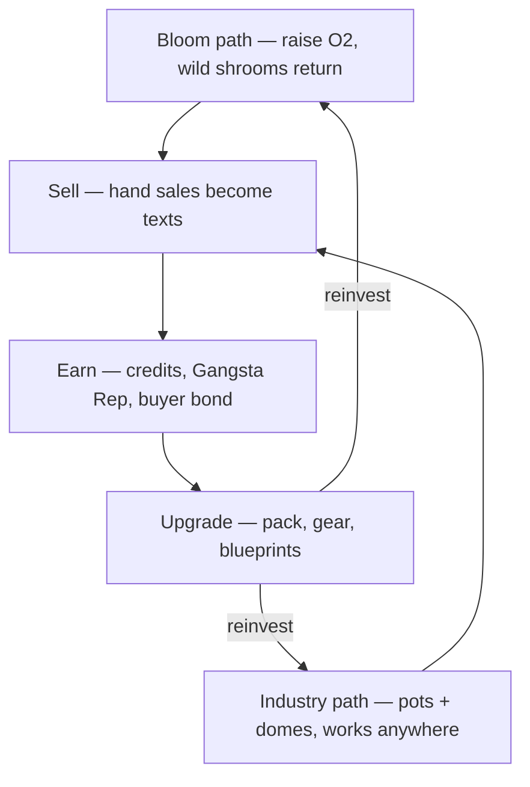

# Handoff — Humble Abode: Cultivation & Dealing Loop, Solo + Co-op (v2)

**Date:** 2026-08-08 · supersedes v1
**From:** Sam (via chat-Claude)
**Target branch:** `feat/helmet-hud` (the live trunk — `main` is stale at Jul 14)
**Goal:** turn the built systems into ONE continuous, understandable game on Humble Abode — playable start-to-finish, solo first, then 2-player co-op. A demo Sam can hand to a friend who plays 45–60 minutes **without Sam explaining anything**.

**Changed in v2:** (1) new wild-respawn system — wild mushrooms return above 50% planet oxygen; (2) production is now canonically **two paths into one loop** (Bloom vs Industry); (3) one-visible-rank UI principle; (4) the loop diagram is included below — build toward it; (5) the v1 idea of scaling dealer-stall payout with oxygen is **withdrawn** — do not build it; (6) status note: the co-op revamp is already at two-machine LAN-testing stage, so Phase B extends that work rather than starting it.

---

## 0. Protocol & hard rules

1. **Rule 4 (GDD_StoryBible_v2 §0):** research first, then state your build plan for Sam's sign-off BEFORE writing code. Per phase.
2. **Never modify the core systems:** floating origin, n-body gravity, and the existing MP architecture (`PlanetRelativeSync`, `SolarSystemSync`, puppet model). Everything integrates ON TOP.
3. **Proof of concept, not final:** simple + tunable + playable beats complete. Expand existing systems; genuinely new pieces are only what's listed under [BUILD]. If you find yourself designing a new system, stop and flag it.
4. Sam places all GameObjects manually. Provide placement manifests; script and wire after placement is confirmed.
5. Every number below is a **named tunable** with the listed default. Sam tunes after playtest; don't hardcode.
6. **Co-op trust model** (friends playing together). No anti-cheat; just keep state consistent.
7. **Simplicity pillar:** the loop must stay simple, replayable, tough, and rewarding. When in doubt, cut toward the diagram below, not away from it.

---

## 1. The loop (canon — build toward this diagram)

**The lap:** grow → sell → earn → upgrade → reinvest in either path. That's the whole minute-to-minute game.

**The ladder** (why lap four feels different from lap one):
wild runs out → Grow pot (Colonizer 2) → Bubble dome (Colonizer 6) → gang war (Gangsta Rep 5) → Dealer stall → next planet (ladder re-arms, harder). Gang war + stall are Phase C.

**Two paths, one supply line (new canon):**
- **Bloom path** — labor-heavy terraforming. Plant trees, raise planet O2. Everything mushroom scales with O2 (speed, size, yield-via-size, spores), and above **50% planet O2 wild mushrooms start respawning naturally** — sparse at first, denser as O2 climbs toward 100%. A bloomed planet becomes a self-sustaining, planet-wide farm.
- **Industry path** — capital-heavy production. Pots and domes mass-grow shrooms with no terraforming required (domes carry their own O2). Compact, controllable, works on barren rock.
- Design intent: **both paths must be independently viable** ways to run the lap and climb the ladder. Bloom trades labor for free planet-wide supply; Industry trades credits/wood for compact guaranteed supply. Most players will mix. Balance decisions get judged against this compass.

---

## 2. [EXISTS] — verify against the repo before planning

- **Mushrooms:** `MushroomSpawner` / `MushroomRegistry` / `MushroomSpecies` / `SpawnedMushroom` / `MushroomGrowth` / `MushroomPlanter` / `MushroomInteraction`. 23 strains (11/7/5 rarity per `MUSHROOM_STRAINS.md`), size roll 1–5× drives cap yield, spores 0–2 species-true, wild consumed cells persist in the save (currently: never respawn — v2 changes this above 50% O2).
- **Oxygen:** `PlanetOxygen` (planet % from living trees vs planet size + local proximity bonus), `OxygenManager`, suit converter. Growth already keys off ambient O2 — confirm exactly where before touching anything.
- **Domes:** `BubbleDome` + `DomeRefuel` / `DomeScreen` / `DomeShieldGrow` / `DomeBuildRegistrar` etc. Sealed interior atmosphere, fuel refills.
- **Building:** `BuildMenuUI` / `BuildableEntry` / `GhostPlacement` / phone `PhoneBuildApp`; `BuildableUnlocks` level→blueprint table (L0 torch/bonfire, L1 walls/floor, to L10).
- **Progression:** `PlayerProgress` five tracks — Tree Killer, Tree Daddy, Colonizer, Gangsta Rep (signed), Explorer — plus General rank (`LevelUpCeremonyUI.RankFor`, CASTAWAY→LEGEND). Only Colonizer grants perks today; unbuilt perk specs in `docs/PROGRESSION_PERKS.md`.
- **Buyers (built Aug 7, editor-tested 26/26):** `BuyerLedger` (bond 0–100 → price up to +15%, regular conversion, hidden-want reveals, saved via `BuyerLedgerSave`), `BuyerMessageDirector` (want-texts, max 3 open, deadline sweep, F6/F7 cheats), `BuyerDeals` (negotiation, 5/10/15-min windows +15/+10/+5%, fuzzy substitution), `MessagesScreen`, `MushroomSellUI`, `NPCMushroomPrice`.
- **Vendors:** goods / ship market / guitar / fish market. Pack upgrades exist as vendor items per `VISION_AND_HOUR_ONE.md`.
- **Onboarding:** `TevMushroomOnboarding` / `MushroomQuest` / `EarlyGameProgress` — 120-second window, 3 free caps, conditional return dialogue. **Stays as-is.**
- **Multiplayer:** NGO 1.12 — puppet architecture, `PlanetRelativeSync`, `SolarSystemSync`, `MultiplayerTestUI`. Currently at two-machine LAN-testing stage — Phase B builds on that state, not from scratch.
- **Misc:** 7-slot hotbar / 20-stack species-pure inventory, shuttle locker + stasis-pod save, physics axe (M3) + damageable/ragdoll aliens + killstreak pipeline (Phase C only), jetpack (old system — untouched this handoff).

Phase-0 research must answer, at minimum: (a) where the 1–5× size roll happens (plant time vs growth-complete); (b) exactly which ambient-O2 value `MushroomGrowth` reads, and whether a shroom inside a dome already reads the dome's interior O2; (c) where spore drops resolve on harvest; (d) how consumed wild cells are stored (this becomes the respawn surface); (e) the vendor stock-table shape; (f) which gameplay objects are already NetworkBehaviours; (g) how wild/planted shroom state replicates in the current LAN build; (h) how the save system will take per-player profile data.

---

## 3. Phase A [BUILD] — the two-path cultivation economy (solo-complete first)

O2 below means the same ambient oxygen value (planet % + local bonus) the growth system already reads, normalized 0–1. The wild-respawn gate in A2 is the one exception: it reads **planet-wide** O2 only.

### A1. Oxygen scales everything about shrooms

- **Growth speed:** already O2-keyed — verify, expose as tunable curve if it isn't, **do not double-apply**.
- **Size:** bias the existing 1–5× roll by O2. Effective max = `lerp(SIZE_MAX_LOW, SIZE_MAX_HIGH, O2)` → defaults **2.0 / 5.0**. Keep the existing roll distribution, clamp by effective max. Floor stays 1×.
- **Yield:** NO separate multiplier — caps already come from size, so yield scaling arrives via size. One lever.
- **Spore drops, ground-planted & wild:** min **0**; max = `round(lerp(SPORE_GROUND_MAX_LOW, SPORE_GROUND_MAX_HIGH, O2))` → defaults **2 / 3**. (0–2 base, 0–3 at 100%.)

### A2. Wild respawn above 50% planet O2 — NEW in v2 (the Bloom path payoff)

- Today, consumed wild cells never come back. v2: a host-side respawn tick can flip consumed cells back to present, gated by **planet** O2 (planet-wide %, not local bonus — this is a terraforming reward).
- Rules:
  - Planet O2 < `WILD_RESPAWN_THRESHOLD` (**0.50**): nothing respawns — current behavior preserved exactly.
  - At or above threshold: every `WILD_RESPAWN_TICK` (**60s**), each consumed cell rolls to respawn with chance `lerp(0, CELL_RESPAWN_CHANCE_AT_100, (O2 − 0.5) / 0.5)` → default **CELL_RESPAWN_CHANCE_AT_100 = 0.01** per cell per tick. Sparse trickle just past 50%, visible regrowth near 100%.
  - **Species-true:** a respawned cell grows the species that cell originally held (the registry knows). Rare strains stay rare.
  - **Density cap for free:** respawn only refills original seeded cells — wild can never exceed first-landing density.
  - Respawned shrooms are normal wild shrooms: O2-scaled size and spores, choppable, re-consumable.
  - State lives in the existing consumed-cell save data (respawn = remove from consumed set). Host-authoritative; replicated like any other cell change.
- Optional polish (small): one-time progress toast when a planet first crosses 50% — "Humble Abode is breathing — wild shrooms returning." Use the existing toast pipeline only; nothing new.

### A3. Grow Pot — new buildable, first main unlock (Industry path, tier 1)

- New `BuildableEntry` ("Grow Pot"), placed via `GhostPlacement`, one shroom socket. Cost `POT_COST_WOOD = 4`. Placeholder mesh fine.
- Planting via existing `MushroomPlanter` flow; pot-grown flag on the spawned shroom.
- **Growth:** × `POT_GROWTH_MULT = 1.5`.
- **Spores:** min = `round(lerp(1, 2, O2))`, max = `round(lerp(2, 4, O2))` → **1–2 on barren dirt, 2–4 at 100% O2**. The guaranteed floor means a pot farm can never dead-end.
- Unlock: `BuildableUnlocks` at **Colonizer `POT_UNLOCK_LEVEL = 2`**.
- **Bootstrap watch:** everyone's first stretch is Bloom-flavored by necessity (wild + ground planting until Colonizer 2) — that's fine, but time-to-Colonizer-2 must reliably arrive before wild stock runs dry on a normal route. If playtests show otherwise, tune Colonizer XP or `POT_UNLOCK_LEVEL` first — don't buff spore numbers.

### A4. Dome interior = 2× grow house (Industry path, tier 2)

- Any shroom inside a dome volume: growth × `DOME_GROWTH_MULT = 2.0`, ambient O2 = the **dome interior** value (confirm per research (b); wire if missing). This is what makes Industry work on barren rock.
- Pot inside dome stacks multiplicatively by default (1.5 × 2.0 = 3×) — [OPEN], build stacking, we tune.
- Dome otherwise unchanged (fuel burn is the balance knob). Unlock: **Colonizer `DOME_UNLOCK_LEVEL = 6`** — reconcile with however domes are currently acquired.

### A5. Perk hooks — build the three unbuilt ones exactly as `PROGRESSION_PERKS.md` specs

- **Tree Daddy:** sapling growth × `(1 + 0.12 × level)`. Saplings only. [OPEN if Sam wants shrooms too.]
- **Tree Killer:** wood per tree = `base + floor(level / 2)`.
- **Gangsta Rep → vendor stock tiers:** 3 tiers at **GR 0 / 3 / 6** gating the goods-vendor table. **Required in base stock: spore packs** — the anti-softlock valve (see §7); a player must always be able to buy their way back into farming, and fish-market income is the credit floor that funds it. Suggested beyond that: base adds pack +2 slots; GR3 = second pack +2, bulk dome fuel; GR6 = premium/rare spore stock. Derive from live GR at shop-open.

### A6. Colonizer ladder (final for the demo)

L0 torch/bonfire → L1 walls/floor (exist) → **L2 Grow Pot** → L3–5 existing pieces + storage → **L6 Bubble Dome** → L8+ reserved (Dealer Stall, Phase C). Locked rows stay visible with padlock + level.

### A7. One visible rank — UI principle (new in v2)

The player-facing progression is the **General rank** (CASTAWAY→LEGEND) — HUD, toasts, and the level-up ceremony lead with it. The five tracks keep earning XP under the hood and appear only on a stats/phone screen. Never surface five bars at once; that is exactly the clutter the simplicity pillar forbids.

### A8. XP sanity pass

Every loop verb feeds its track: chop tree → Tree Killer; chop shroom → Tree Killer (or its own hook — research what exists); sapling matures → Tree Daddy; place buildable → Colonizer; completed deal/sale → Gangsta Rep. Every grant announces through the existing toast/ceremony pipeline (leading with General rank per A7).

---

## 4. Phase B [BUILD] — co-op economy sync (extends the current LAN test)

**The model (canon from Sam): separate wallets, shared world.** Each player earns, spends, and upgrades individually. The world is one shared state both players build together.

### B1. Authority

Host-authoritative simulation: O2 tick, shroom growth, **wild respawn tick**, spawner/consumed-cell state, `BuyerMessageDirector` timers and sweeps run on the host; clients receive replicated state and send intent RPCs (chop result, plant, place, deposit/withdraw, accept, sell/deliver). Reuse the puppet + `PlanetRelativeSync` layer as-is.

### B2. Per-player vs shared

- **Per-player:** wallet/credits, hotbar + inventory + held items, gear purchases, all progression tracks incl. General rank [OPEN — default per-player]. Blueprint placement gated by the **placing player's** Colonizer.
- **Shared (replicated world state):** trees/saplings + planet O2, wild cells (consumed AND respawned), planted shrooms (growth, size, pot/dome flags), all buildables, locker/storage contents, and the entire buyer layer — `BuyerLedger` bond/regulars/reveals/appointments and open want-texts are company-level.

### B3. Deals in co-op

- Want-texts broadcast to all phones. **First ACCEPT claims** — lock replicates; the other player's accept is cleanly rejected in-thread.
- Only the claimer's DELIVER resolves. **Payout → claimer's wallet.** Bond/regular effects → shared ledger. Missed claimed deals penalize the shared bond.
- Walk-up sales resolve host-side against the ledger, pay the selling player.
- **Joint purchases:** Sam is picking the category both players pay into. Build NO UI — leave the cost entry able to accept contributions from more than one wallet. [OPEN]

### B4. Saves

Host owns the world + ledger save (existing save system + `BuyerLedgerSave`), including consumed/respawned cell state. Guest's personal profile (wallet, levels, gear) persists on the **guest's machine**, keyed to the host save/session id — research the cleanest fit; a per-machine profile file is acceptable for the demo.

### B5. Internet join (build last, only after LAN is stable)

Sam refuses port forwarding. On NGO the native path is **Unity Relay** (UTP + join code). Zero-code stopgap for a quick test: Tailscale. Keep isolated from everything above.

---

## 5. Phase C [LATER — do not build yet; plan after Sam playtests A+B]

Context only: rival gang shakedown triggers off Gangsta Rep/credits; pay-a-cut vs fight (GR goes negative, some regulars pause); den assault uses existing axe combat + killstreak; clearing it unlocks the **Dealer Stall** (Colonizer top blueprint, gated by the den flag) — stall holds stock and auto-resolves small want-texts for `DEALER_CUT = 30%`. Stall payout does **NOT** scale with oxygen (v1 idea withdrawn). Earnings split in co-op [OPEN — candidate for the joint-purchase idea]. Full spec later.

---

## 6. Tunables (defaults)

| Name | Default | Meaning |
|---|---|---|
| SIZE_MAX_LOW / HIGH | 2.0 / 5.0 | size-roll cap at 0% / 100% O2 |
| SPORE_GROUND_MAX_LOW / HIGH | 2 / 3 | ground+wild spore max at 0% / 100% (min 0) |
| WILD_RESPAWN_THRESHOLD | 0.50 | planet O2 where wild respawn begins |
| WILD_RESPAWN_TICK | 60 s | host respawn roll interval |
| CELL_RESPAWN_CHANCE_AT_100 | 0.01 | per-cell chance per tick at 100% O2 (0 at threshold) |
| POT_GROWTH_MULT | 1.5× | pot growth speed |
| POT_SPORE_MIN_LOW / HIGH | 1 / 2 | pot spore min at 0% / 100% |
| POT_SPORE_MAX_LOW / HIGH | 2 / 4 | pot spore max at 0% / 100% |
| POT_COST_WOOD | 4 | pot build cost |
| POT_UNLOCK_LEVEL | Colonizer 2 | |
| DOME_GROWTH_MULT | 2.0× | interior growth multiplier |
| DOME_UNLOCK_LEVEL | Colonizer 6 | |
| GR_STOCK_TIERS | 0 / 3 / 6 | vendor stock gates |
| DEALER_CUT | 30% | Phase C only |

---

## 7. [TEST] — acceptance

**Solo:**
- Fresh start: Tev flow intact end-to-end (120s window → 3 caps → sell → return dialogue → texts begin).
- Low-O2 chop: spores 0–2, sizes bias small. Ring a plot with ~10 trees: growth speed, size ceiling, and spore max all visibly move.
- **Wild respawn:** at 49% planet O2, no cell ever respawns (soak test); crossing 50% starts a sparse trickle; at high O2 the rate is visibly higher; respawned cells are species-true and never exceed original density; state survives save/load.
- Pot harvest never below 1 spore; pot at ~100% O2 gives 2–4. Dome shroom grows ~2× a control outside.
- **Path viability:** a pure-Industry run (ignore trees; pots + dome only) and a pure-Bloom run (no pots; trees + wild + ground planting) can both sustain the lap and afford upgrades.
- Perks apply and announce; UI leads with General rank everywhere (A7); wild consumed cells below 50% stay consumed across save/load.
- **Softlock probe:** spend every spore and exhaust nearby wild below 50% O2 — a recovery path must exist (fish-market income → base-stock spore pack).

**Co-op (2-player LAN):**
- Guest joins; both see the same planted shrooms grow and pop.
- Guest chops wild → consumed for host too, including after host save/reload; a cell that respawns appears for both, and re-chopping it re-consumes for both.
- Guest plants into a host-placed pot; either harvests; spore floor holds.
- Want-text on both phones; host accepts → guest's accept cleanly rejected; payout lands only in the claimer's wallet; wallets diverge correctly after mixed sales.
- Guest below Colonizer 2 cannot place a pot; at 2+, can. Locker: deposited by one, withdrawable by the other.
- Floating-origin rebase mid-co-op-farming: no desync, no fling (regression-test the Aug 7 fixes). F6/F7 cheats work.

---

## 8. [OPEN] — Sam decides (don't block; defaults noted)

1. Joint-purchase upgrade category (candidates: dealer stall, first ship).
2. Progression tracks per-player vs shared (default: per-player).
3. Pot × dome stacking (default: multiplicative 3×).
4. Tree Daddy affecting shroom growth too (default: saplings only).
5. Exact vendor stock rows per GR tier.
6. All numbers — tune after the first playtest; that's what the tunables are for.

---

## 9. Parked — explicitly do NOT build

Jetpack tier upgrades L1–4 (jetpack exists and stays untouched; tiers noted for later). Gangsta Rep weapon unlocks. Heat/police. Story/missions. Planet 2. Flower/fruit bloom thresholds. Frump taking over the pinned phone thread. Oxygen-scaled stall payout (withdrawn).

---

## 10. Reference docs in `/docs`

`VISION_AND_HOUR_ONE.md` (pacing bible), `PROGRESSION_PERKS.md`, `MUSHROOM_ECONOMY.md`, `MUSHROOM_STRAINS.md`, `CURRENT_STATE_AUDIT.md` §33 (buyer system), `Handoff_Multiplayer_LAN_Test_v4` (MP constraints). `GDD_StoryBible_v2.md` predates the pivot — canon for tone/characters only.
